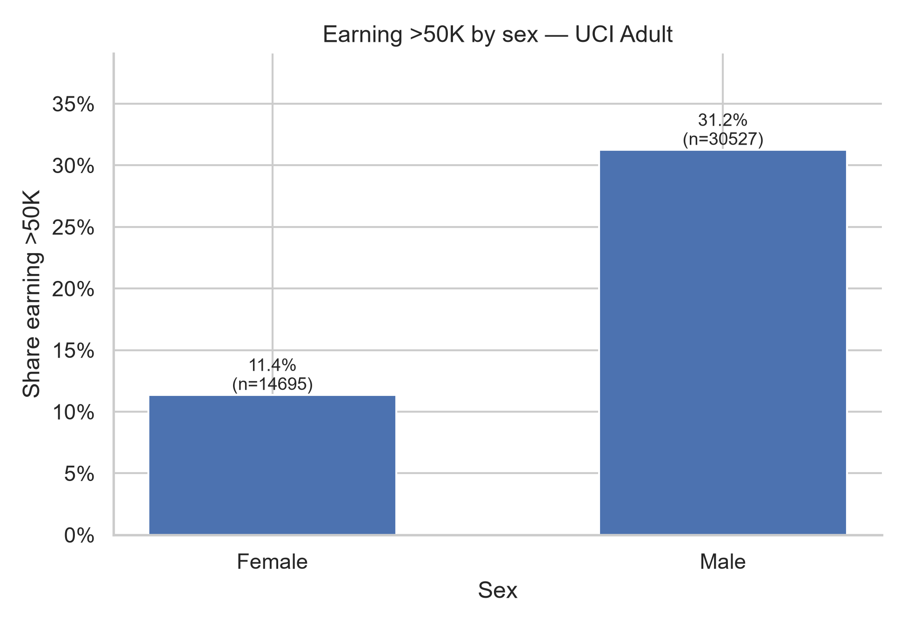
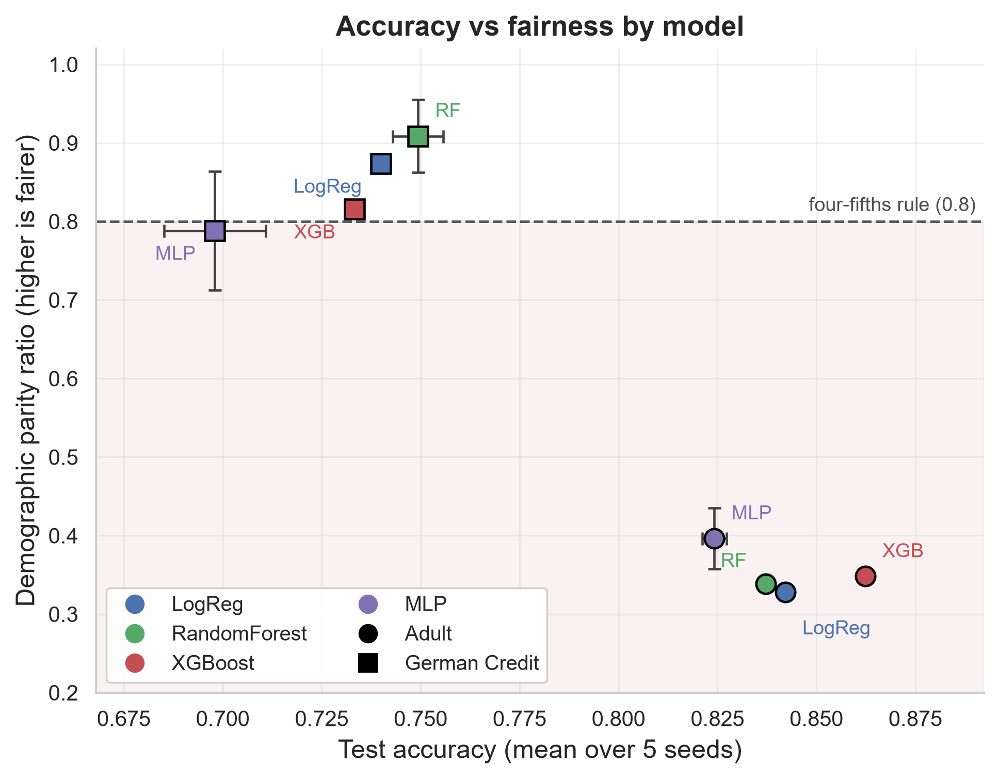
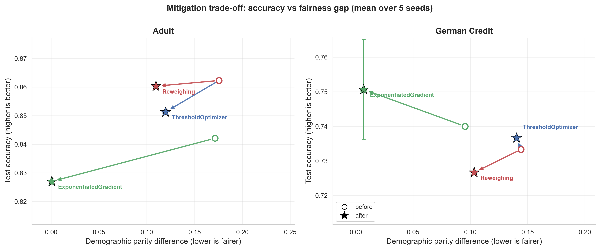
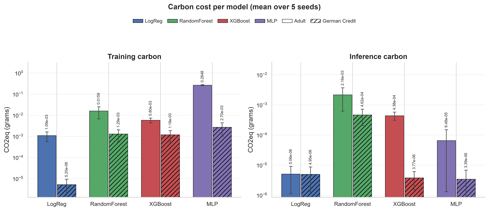
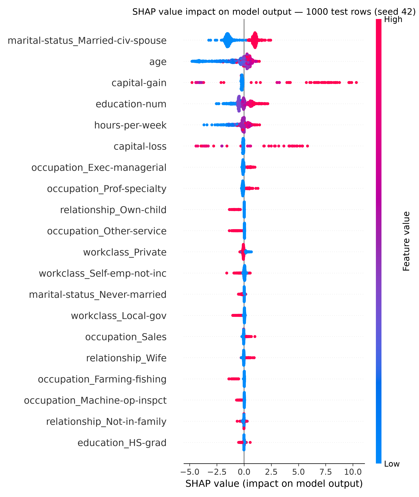
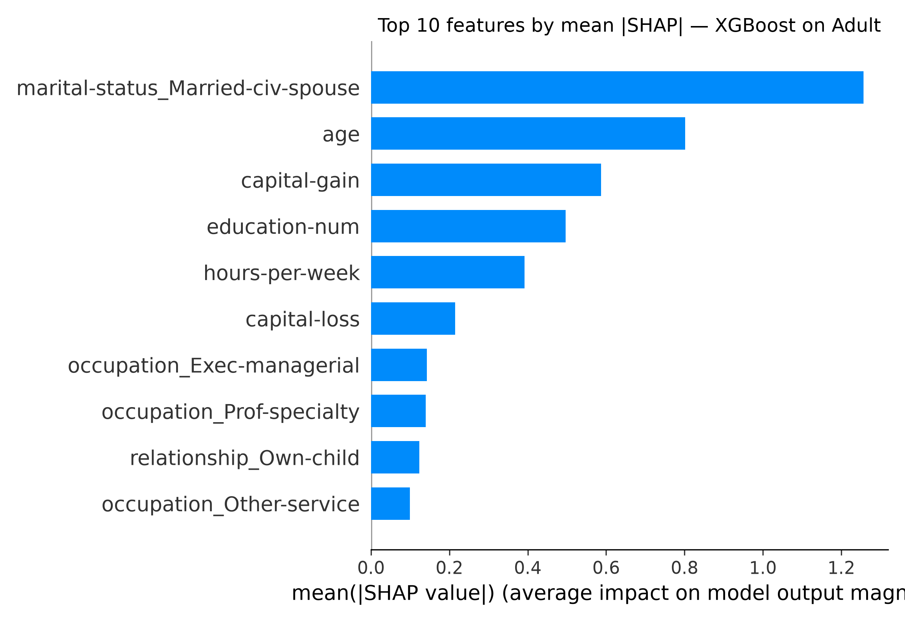
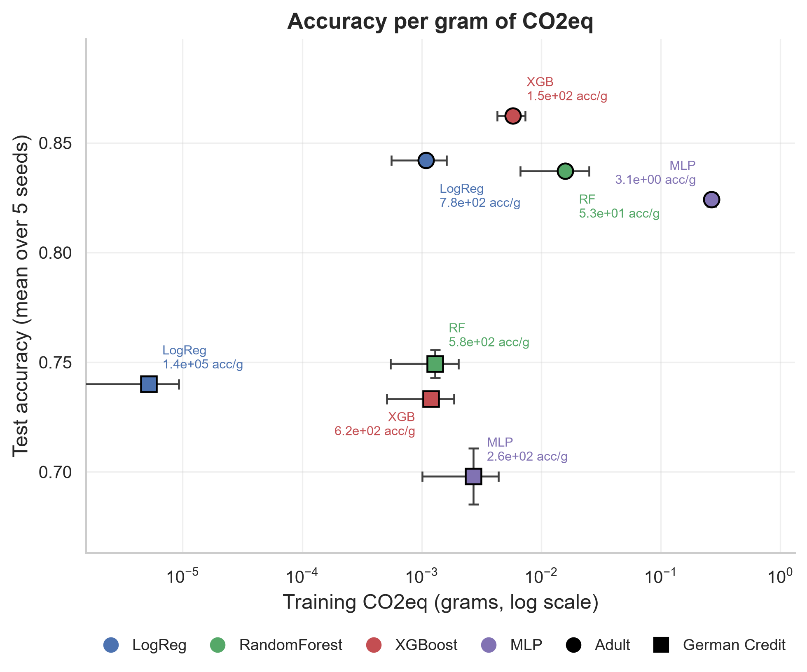

# Accuracy, Fairness, and Carbon Cost
### Auditing Machine Learning Models on Loan and Income Data

## Abstract

Machine-learning audits usually report one number at a time — accuracy, or a fairness gap, or emissions. This project reports all three for the same models on the same data splits. Logistic regression, a random forest, XGBoost and a multilayer perceptron are trained on two OpenML datasets, Adult (census income) and German Credit (credit risk), with the protected attribute removed from the feature set and retained only as an audit label. Every fit and every inference is measured with codecarbon — grams of CO₂eq, training and scoring tracked separately — and every model is scored with fairlearn's demographic-parity and equalized-odds metrics alongside accuracy, F1 and ROC-AUC. Three mitigation strategies (threshold optimisation, exponentiated gradient, reweighing) are compared before and after, and SHAP explanations probe whether the removed attribute leaks back in through correlated features. The pattern across the tables: the accuracy leader differs between datasets, the unmitigated demographic-parity gaps on Adult are far larger than on German Credit, mitigation shrinks those gaps at a modest accuracy cost, and most of the measured carbon comes from training rather than scoring. Everything below is read from `results/*.csv` and `figures/`, both regenerated end-to-end by a single command.

## Research questions

- **Accuracy.** How do standard classifiers compare on loan- and income-prediction tasks, and does the ranking transfer between datasets?
- **Fairness.** How large are the demographic-parity and equalized-odds gaps between protected groups in unmitigated models, and do they satisfy the four-fifths rule?
- **Mitigation.** Can threshold optimisation, exponentiated gradient or reweighing close those gaps, and what accuracy do they cost?
- **Carbon.** What does each model emit during training versus scoring, and which one delivers the most accuracy per gram?
- **Proxies.** Does dropping the protected attribute from the features keep it out of the decision, or do correlated features leak it back in?
- **Transfer.** Do conclusions drawn on Adult hold on a smaller dataset with a different protected group?

## Datasets

- **Adult** — census income records from OpenML (loader: `load_adult` in `src/data.py`). The audit attribute is `sex`, with `Female` and `Male` groups; `sex`, `race`, `fnlwgt` and the label are dropped from the features. The EDA table records 14695 `Female` and 30527 `Male` rows, with high-income shares of 0.1136 and 0.3125 respectively (`results/eda_sex_income.csv`).
- **German Credit** — credit-risk records from OpenML (loader: `load_german_credit` in `src/data.py`). The audit attribute is age, grouped as `25+` versus `under25`, with `age` dropped from the features. It is far smaller than Adult, so the pipeline prints `SMALL_SAMPLE_WARNING` whenever it runs.

Both loaders one-hot encode the categoricals, use a stratified train/test split held fixed across all runs, and return the split together with the audit attribute. Model seeds vary — the per-seed rows in `results/model_runs.csv` cover seeds 0 through 4.

## Repository structure

```text
.
├── AGENTS.md                     # project rules and conventions
├── README.md                     # this file
├── requirements.txt
├── run_all.py                    # runs every stage in order, stops on first error
├── .venv/                        # virtual environment (git-ignored)
├── data/                         # raw data cache (git-ignored, never committed)
├── src/
│   ├── check_env.py              # verify the environment and print versions
│   ├── data.py                   # dataset registry, loaders, split, warnings
│   ├── eda.py                    # outcome-by-sex table and fig1
│   ├── train.py                  # model fitting, CO₂eq tracking, table writer
│   ├── fairness.py               # fairlearn scoring, per-group tables
│   ├── mitigation.py             # three mitigation strategies, before/after
│   ├── explain.py                # SHAP summary and sex-proxy probe (fig5*)
│   └── figures.py                # rebuilds fig2/fig3/fig4/fig6 from CSVs alone
├── results/                      # every CSV the numbers below come from
│   ├── eda_sex_income.csv
│   ├── baselines.csv             # majority baseline and group sizes
│   ├── model_runs.csv            # one row per model × seed × dataset
│   ├── model_summary.csv         # mean and sd over seeds
│   ├── per_group_accuracy.csv    # accuracy and selection rate per group
│   ├── mitigation_runs.csv
│   ├── mitigation_summary.csv
│   └── proxy_features.csv        # top SHAP features and their sex correlation
├── figures/                      # PNG figures
│   ├── fig1_outcome_by_sex.png
│   ├── fig2_accuracy_vs_fairness.png
│   ├── fig3_mitigation_tradeoff.png
│   ├── fig4_carbon_per_model.png
│   ├── fig5_shap_summary.png
│   ├── fig5b_shap_top10_bar.png
│   └── fig6_accuracy_per_gram_co2.png
└── notebooks/
    └── fairness_carbon_audit.ipynb   # guided walkthrough of the whole study
```

## Setup and run

```bash
# one-time setup
python -m venv .venv
source .venv/bin/activate          # Windows: .venv\Scripts\activate
pip install -r requirements.txt
python src/check_env.py            # fails loudly if a dependency is missing

# the whole study: eda -> baselines -> train -> fairness -> mitigation
#                  -> explain -> german_credit -> figures
python run_all.py
```

`run_all.py` runs each stage in its own interpreter, prints the exact command it is executing, and stops immediately with a non-zero exit if any stage fails. Stage table writers replace only the datasets they processed, so running the stages dataset by dataset still ends with the same combined `results/*.csv`.

Useful variants:

```bash
python run_all.py --list                 # show the stages
python run_all.py figures                # re-run selected stages only
python src/train.py german_credit        # one stage, one dataset
python src/fairness.py                   # one stage, all datasets
```

Then open the guided walkthrough, which imports from `src/` and displays every result table and figure:

```bash
jupyter notebook notebooks/fairness_carbon_audit.ipynb
```

## Key results

All values below are read from `results/model_summary.csv`, `results/mitigation_summary.csv` and `results/baselines.csv`. Accuracy columns are the mean and standard deviation over the model seeds recorded in `results/model_runs.csv`; CO₂eq columns are grams.

| Dataset | Model | Accuracy | Acc. sd | Parity ratio | Equalized-odds diff. | Train CO₂eq (g) | Inference CO₂eq (g) |
|---|---|---|---|---|---|---|---|
| adult | logreg | 0.8421 | 0.0000 | 0.3279 | 0.0929 | 0.00108537 | 5.06137e-06 |
| adult | random_forest | 0.8372 | 0.0010 | 0.3385 | 0.0914 | 0.0158695 | 0.00215555 |
| adult | xgboost | 0.8623 | 0.0000 | 0.3482 | 0.0713 | 0.00579552 | 0.000437789 |
| adult | mlp | 0.8242 | 0.0031 | 0.3963 | 0.0930 | 0.264805 | 6.48383e-05 |
| german_credit | logreg | 0.7400 | 0.0000 | 0.8737 | 0.1279 | 5.19829e-06 | 4.95236e-06 |
| german_credit | random_forest | 0.7493 | 0.0064 | 0.9088 | 0.1109 | 0.0012911 | 0.000461504 |
| german_credit | xgboost | 0.7333 | 0.0000 | 0.8156 | 0.2266 | 0.00118883 | 3.76994e-06 |
| german_credit | mlp | 0.6980 | 0.0128 | 0.7882 | 0.1746 | 0.00269756 | 3.38796e-06 |

Reading the table: accuracy leaders differ by dataset (XGBoost on Adult, random forest on German Credit), while the parity ratios tell the opposite story — every Adult model sits far below the four-fifths rule, and most German Credit models clear it. Against the majority-class baselines in `results/baselines.csv` (0.7522 on Adult, 0.7000 on German Credit), every model clears its baseline except the German Credit multilayer perceptron at 0.6980. The full table in `results/model_summary.csv` also carries F1, ROC-AUC, demographic-parity differences, per-group accuracies, selection rates and wall-clock times.

### Mitigation, before → after

Each method is compared against its own unmitigated baseline (`results/mitigation_summary.csv`):

| Dataset | Method | Accuracy | Parity difference | Parity ratio |
|---|---|---|---|---|
| adult | threshold_optimizer | 0.8623 → 0.8513 | 0.1755 → 0.1197 | 0.3482 → 0.5318 |
| adult | exponentiated_gradient | 0.8421 → 0.8270 | 0.1713 → 0.0006 | 0.3279 → 0.9961 |
| adult | reweighing | 0.8623 → 0.8603 | 0.1755 → 0.1096 | 0.3482 → 0.5371 |
| german_credit | threshold_optimizer | 0.7333 → 0.7367 | 0.1443 → 0.1404 | 0.8156 → 0.8197 |
| german_credit | exponentiated_gradient | 0.7400 → 0.7507 | 0.0954 → 0.0068 | 0.8737 → 0.9913 |
| german_credit | reweighing | 0.7333 → 0.7267 | 0.1443 → 0.1033 | 0.8156 → 0.8646 |

Exponentiated gradient closes most of the parity gap on both datasets; reweighing and threshold optimisation move the gaps less, and all rows keep their accuracy close to the baseline.

## Figures

Outcome rate by sex on Adult:



Accuracy versus demographic-parity ratio, with the four-fifths line and the failing region shaded:



Mitigation trade-offs (marker size encodes accuracy):



Training and inference emissions per model, log scale:



SHAP summary and top features for the Adult baseline:





Accuracy per gram of training CO₂eq — accuracy on the vertical axis, training emissions on a log axis:



`fig1`, `fig5` and `fig5b` are produced by `src/eda.py` and `src/explain.py`; the other four are rebuilt from `results/*.csv` alone by `src/figures.py`.

## Limitations

- German Credit is small, so its per-group metrics, per-group accuracies and CO₂eq readings are noisy — the `under25` test group holds only 47 rows (`results/baselines.csv`). The project states this in `SMALL_SAMPLE_WARNING` and repeats it in program output.
- CO₂eq figures come from codecarbon on one machine under one workload; they are estimates. Relative comparisons between models and phases are meaningful, absolute values are not portable.
- The data split is fixed across all runs, so the seed spread measures model randomness only, not variation between splits.
- The protected attributes studied are `sex` on Adult and age group on German Credit; intersectional groups (for example sex within age group) are not modelled.
- Fairness is measured with demographic parity and equalized odds only; other fairness definitions may rank the models differently.
- SHAP explanations and the proxy probe are produced for the Adult baseline only.
- Mitigation is evaluated at fixed hyperparameters rather than across a tuned accuracy-fairness frontier.

## License

Released under the **MIT License**. Permission is hereby granted, free of charge, to any person obtaining a copy of this software and associated documentation files (the "Software"), to deal in the Software without restriction, including without limitation the rights to use, copy, modify, merge, publish, distribute, sublicense, and/or sell copies of the Software, and to permit persons to whom the Software is furnished to do so, subject to the following conditions:

The above copyright notice and this permission notice shall be included in all copies or substantial portions of the Software.

THE SOFTWARE IS PROVIDED "AS IS", WITHOUT WARRANTY OF ANY KIND, EXPRESS OR IMPLIED, INCLUDING BUT NOT LIMITED TO THE WARRANTIES OF MERCHANTABILITY, FITNESS FOR A PARTICULAR PURPOSE AND NONINFRINGEMENT. IN NO EVENT SHALL THE AUTHORS OR COPYRIGHT HOLDERS BE LIABLE FOR ANY CLAIM, DAMAGES OR OTHER LIABILITY, WHETHER IN AN ACTION OF CONTRACT, TORT OR OTHERWISE, ARISING FROM, OUT OF OR IN CONNECTION WITH THE SOFTWARE OR THE USE OR OTHER DEALINGS IN THE SOFTWARE.

Copyright (c) the authors.

## How to cite

> ahmedbinjaffar. *Accuracy, Fairness, and Carbon Cost: Auditing Machine Learning Models on Loan and Income Data.* Reproducible research project.

```bibtex
@misc{ahmedbinjaffar_auditing_loan_income,
  title        = {Accuracy, Fairness, and Carbon Cost: Auditing Machine
                  Learning Models on Loan and Income Data},
  author       = {ahmedbinjaffar},
  howpublished = {Reproducible research project},
  note         = {Source code, result tables and figures; regenerate with
                  \texttt{python run\_all.py}}
}
```
